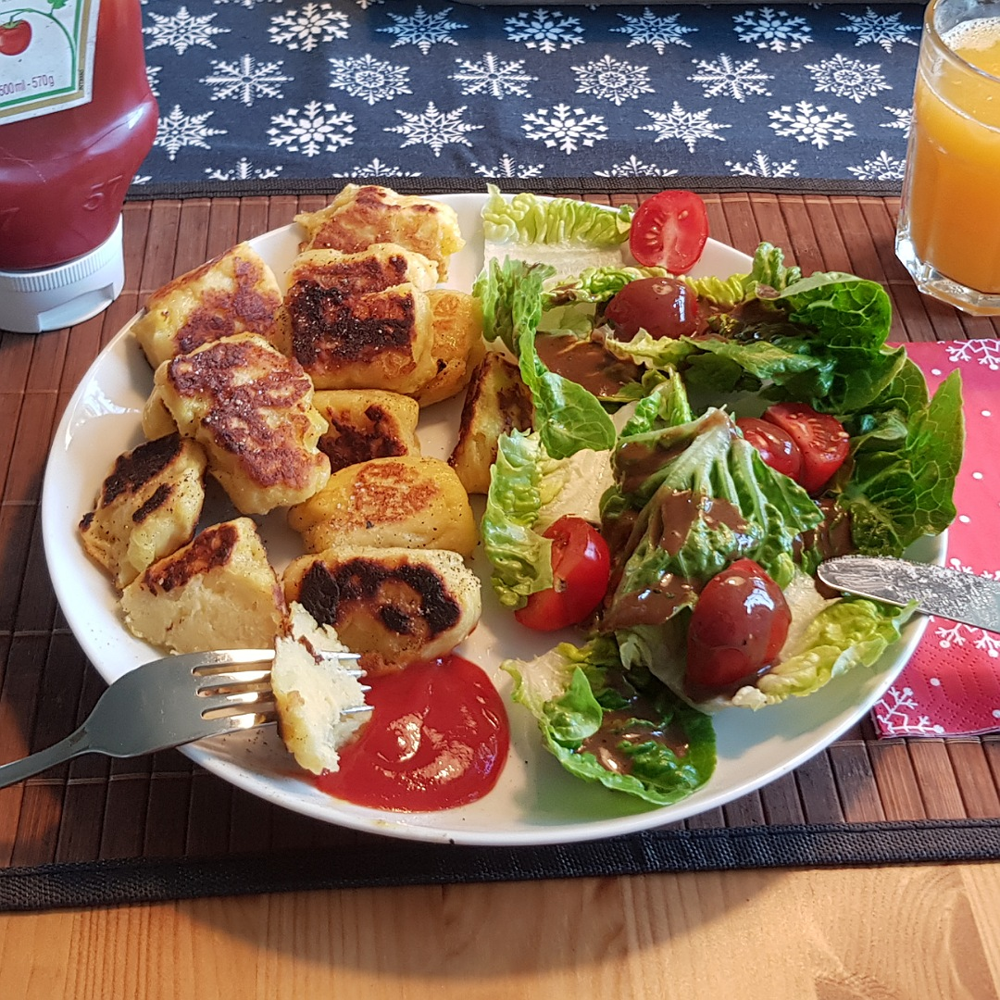

# Gnocchi



## Source code
Run the following code to cook one meal:

```c
#include <kitchen.h>

// recipes below main
void cook_potatoes(Potatoes potatoes);

int main() {

    // ingredients
    Potatoes potatoes = 100 * G;
    Flour    flour    = 100 * G;
    Egg      egg      = 1;

   
    // cook potatoes (see below)
    cool_potatoes;

    // make gnocci dough
    // todo

    serve();
}

void cook_potatoes(Potatoes potatoes) {
    pot_fill_water_L(2);
    pot_heat_level(9);
    pot_wait_until_boil();
    pot_include(potatoes);
    hourglass_sleep_min(15);
    pot_pour_out();
}

```
