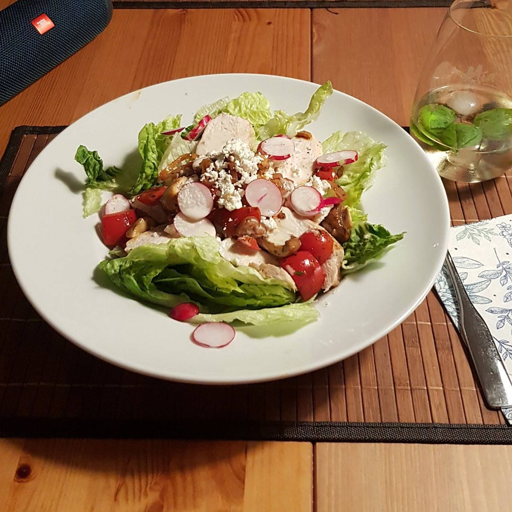

# Julius Salad



## Source code
Run the following code to cook one meal:

```c
#include <kitchen.h>

// recipes below main
void bake_chicken_breast(ChickenBreast chicken);


int main() {

    // ingredients
    ChickenBreast chicken   = 1;

    // cook chicken breast (see below)
    cook_in_parallel(bake_chicken_breast, chicken);

    // todo...

    serve();
}

void bake_chicken_breast(ChickenBreast chicken) {
    oven_heat_C(160);
    wash_under_water(chicken);
    pan_heat_level(8);
    pan_include(3*SPOON_OLIVE_OIL);
    pan_include(chicken);
    hourglass_wait_min(2);
    pan_turn_content();
    pan_include(SALT_AND_PEPPER);
    hourglass_wait_min(2);
    oven_include(chicken);
    hourglass_wait_min(20);
    oven_take_out(chicken);
}

```
