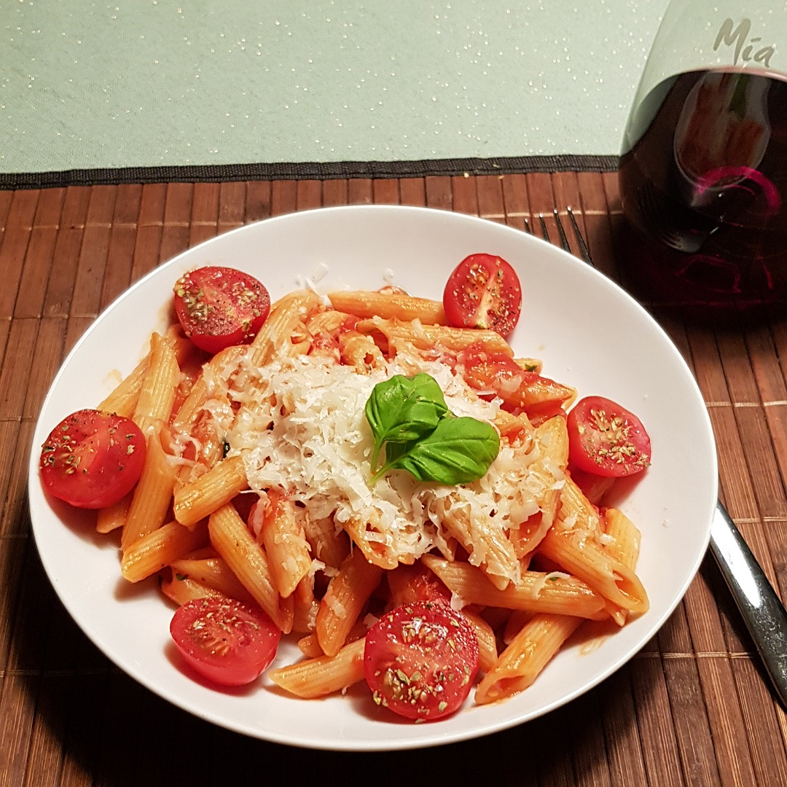

# Penne all Arrabbiata



## Source code
Run the following code to cook one meal:

```c
#include <kitchen.h>

// recipe below main
void cook_penne(Portion *penne);

static const bool spicy = true;

int main() {

    // ingredients
    Portion *penne    = Penne_g(125);
    Portion *tomatoes = CannedTomatoes_g(200);
    Portion *garlic   = Garlic(1);
    Portion *chili    = RedChili_cm(spicy ? 1.5 : 0.5);
    Portion *parsley  = Parsley(10)
    

    // penne (see below)
    Task penne_task = cook_in_parallel(cook_penne, penne);

    // make sauce
    knife_cut_slices(chili);
    knife_cut_into_pieces(tomatoes);
    pan_heat_level(8);
    pan_include(SPOON_OLIVE_OIL);
    pan_include(garlic);
    pan_include(chili);
    hourglass_wait_min(2);
    pan_include(tomatoes);
    pan_heat_level(4);
    hourglass_wait_min(6);
    pan_include(pot_take_off(SALT_WATER));
    knife_cut_into_pieces(parsley);
    pan_take_out(garlic);
    
    // wait for the cooked penne
    Task_join(penne_Task);
    
    pan_heat_level(8);
    pan_include(penne);
    pan_include(parsley);
    hourglass_wait_min(2);

    serve();
}

void cook_penne(Portion *penne) {
    pot_fill_water_L(2);
    pot_heat_level(9);
    pot_wait_until_boil();
    pot_include(SALT);
    pot_include(penne);
    hourglass_wait_min(PENNE_COOK_TIME);
    pot_pour_out();
}

```
