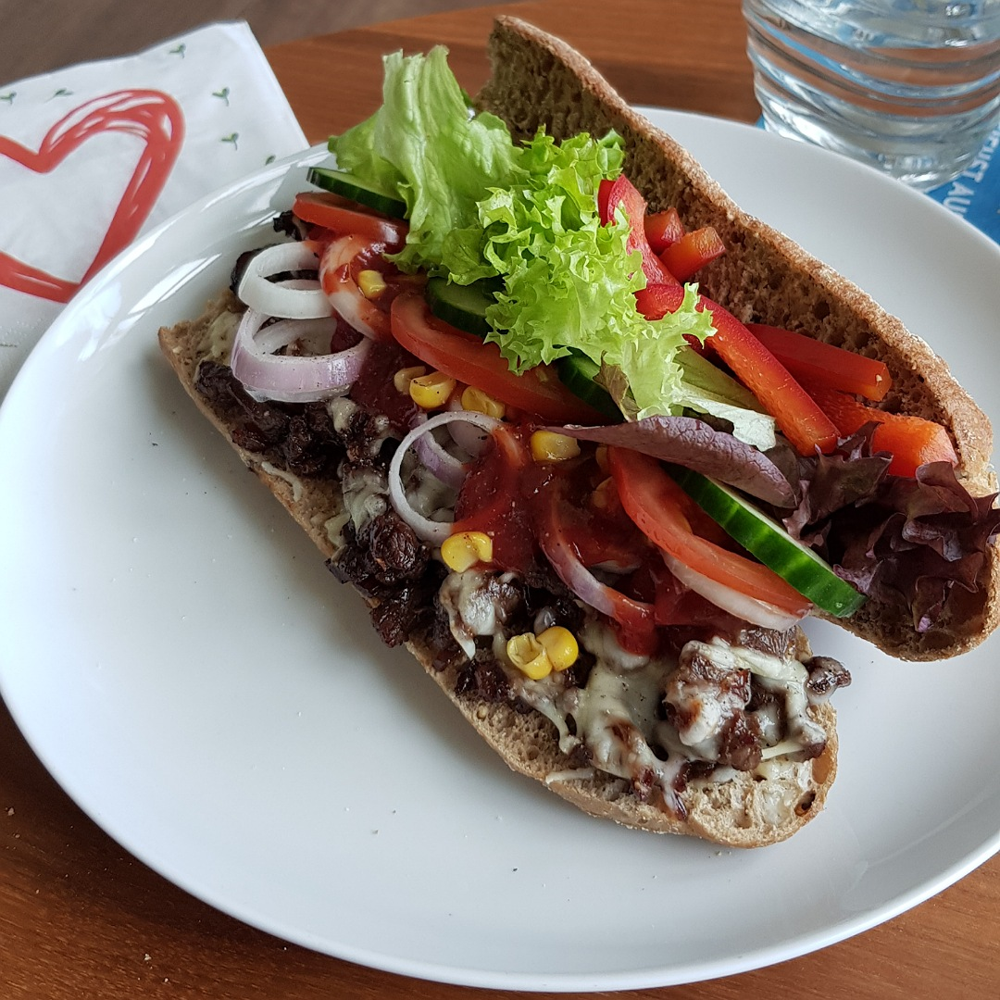

# Philly Cheesesteak



## Source code
Run the following code to cook one meal:

```c
#include <kitchen.h>


int main() {

    // ingredients
    Portion *steak      = BeefSteak_g(100);
    Portion *bellpepper = Bellpepper_quater(1); // green 
    Portion *onion      = Onion(1);
    Portion *cheese     = Cheese_g(30);
    Portion *bread      = LongBread_cm(20);


    knife_cut_into_pieces(steak); 
    knife_cut_into_pieces(bellpepper);
    knife_cut_into_pieces(onion);

    bowl_include(steak);
    bowl_include(bellpepper);
    bowl_include(onion);
    bowl_include(SPOON_RAPESEED_OIL);
    bowl_include(SPOON_RED_WINE_VINEGAR);
    bowl_include(SALT_AND_PEPPER);
    bowl_mash();

    hourglass_wait_min(60);

    pan_heat_level(9);
    pan_include(SPOON_RAPESEED_OIL);
    pan_include(bowl_content());
    hourglass_wait_min(7);

    oven_turn_on_grill_setting();

    knife_slice(bread);
    put_on(bread, pan_content());
    put_on(bread, cheese);

    oven_include(bread);
    hourglass_wait_min(3);
    oven_take_out(bread);

    put_on(bread, BBQ-SAUCE);

    // bread put on onion-slices, corn, tomatoes, salad, ...

    serve();
}

void cook_spaghetti(Portion *spaghetti) {
    pot_fill_water_L(2);
    pot_heat_level(9);
    pot_wait_until_boil();
    pot_include(SALT);
    pot_include(spaghetti);
    hourglass_wait_min(SPAGHETTI_COOK_TIME);
    pot_pour_out();
}

```
