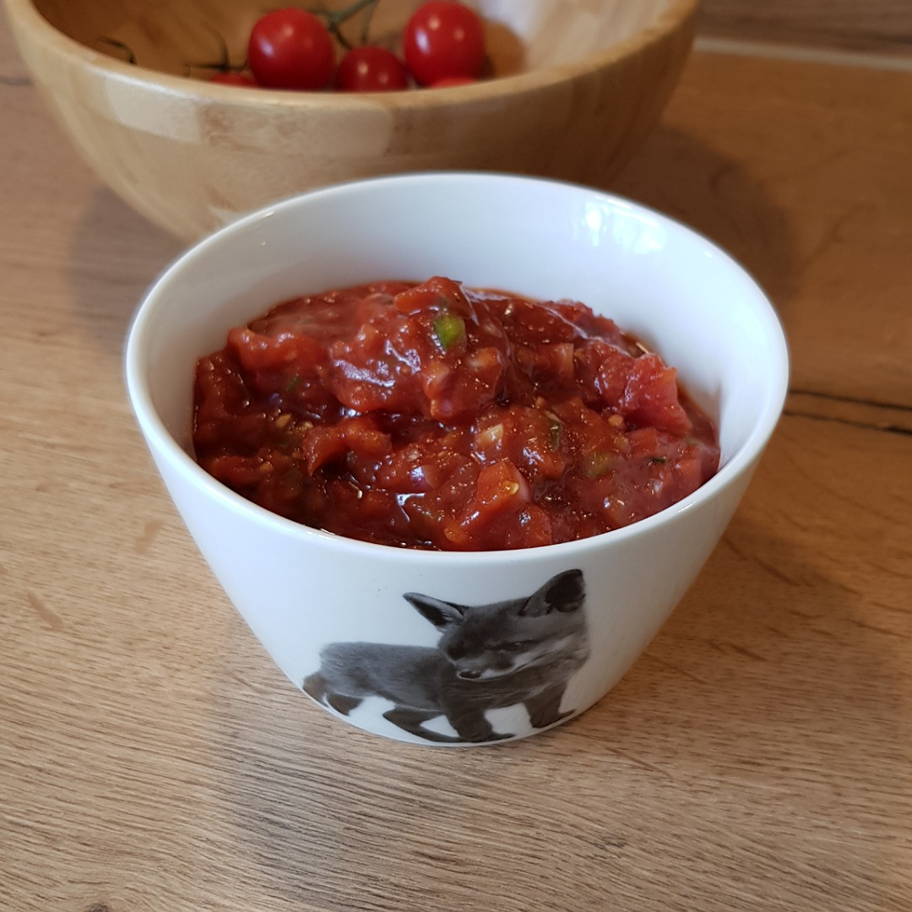

# Salsa



## Source code
Run the following code to cook a sauce:

```c
#include <kitchen.h>

// recipe below main
void cook_tomatoes(Portion *tomatoes);

int main() {

    // ingredients
    Portion *tomatoes = Tomatoes(4);
    Portion *garlic   = Garlic(1);
    Portion *onion    = Onion(1);
    
    // prepare tomatoes (see below)
    cook_tomatoes(tomatoes);

    knife_cut_into_pieces(garlic);
    knife_cut_into_pieces(onion);

    // todo
    
    serve();
}

void cook_tomatoes(Portion *tomatoes) {
    pot_fill_water_L(1);
    pot_heat_level(9);
    pot_include(tomatoes);
    pot_wait_until_boil();
    pot_heat_level(4);
    hourglass_wait_min(15);
    pot_pour_out();

    // cool down the tomatoes
    hourglass_wait_min(10);
    pull_off_skin(tomatoes);
}

```
