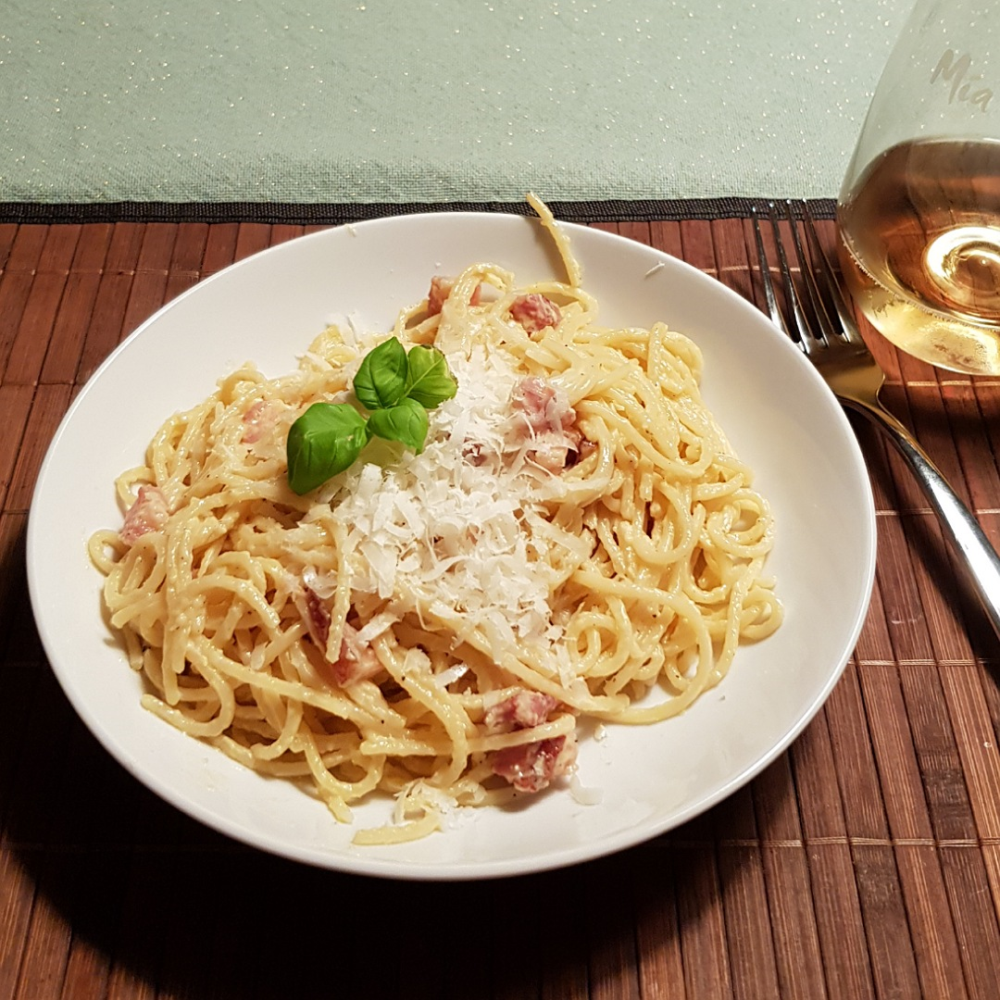

# Spaghetti Carbonara



## Source code
Run the following code to cook one meal:

```c
#include <kitchen.h>

// recipe below main
void cook_spaghetti(Portion *spaghetti);

int main() {

    // ingredients
    Portion *speghetti = Spaghetti_g(100);
    Portion *bacon     = DriedBacon_g(60); // pancetta or guanciale
    Portion *cheese    = Parmesan_g(30);
    Portion *egg       = Egg(2);


    // cook spaghetti (see below)
    Task spaghetti_task = cook_in_parallel(cook_spaghetti, spaghetti);

    knife_cut_into_pieces(bacon); 
    pan_heat_level(7);
    pan_include(bacon);
    
    slice(cheese);
    bowl_include(cheese);
    EggYolk yolk = seperate(egg);
    bowl_include(yolk);
    bowl_include(PEPPER);
    bowl_include(pot_take_off(SALT_WATER));
    bowl_mix();

    // wait for spaghettis
    Task_join(spaghetti_task);

    pan_include(spaghetti);
    pan_include(bowl_content());
    pan_include(pot_take_off(SALT_WATER));
    hourglass_wait_min(2);

    serve();
}

void cook_spaghetti(Portion *spaghetti) {
    pot_fill_water_L(2);
    pot_heat_level(9);
    pot_wait_until_boil();
    pot_include(SALT);
    pot_include(spaghetti);
    hourglass_wait_min(SPAGHETTI_COOK_TIME);
    pot_pour_out();
}

```
