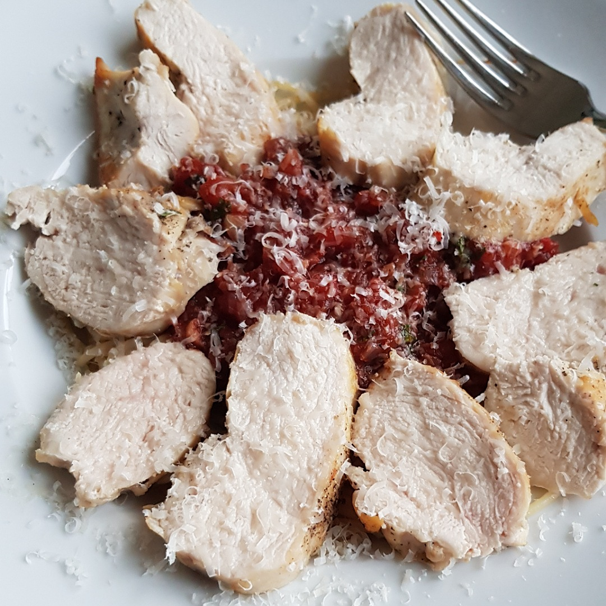

# Spaghetti Pollo al pomodoro salato



## Source code
Run the following code to cook one meal:

```c
#include <kitchen.h>

// recipes below main
void bake_chicken_breast(Portion *chicken);
void cook_spaghetti(Portion *spaghetti);

int main() {

    // ingredients
    Portion *speghetti = Spaghetti_g(100);
    Portion *tomatoes  = CannedTomatoes_g(100);
    Portion *chicken   = ChickenBreast(1);
    Portion *onion     = Onion(1);
    Portion *garlic    = Garlic(1);
    Portion *parsley   = Parsley(6);
    Portion *wine      = WhiteWine_ml(100);
    
    
    salt(chicken);
    hourglass_wait_min(30);

    // cook chicken breast (see below)
    cook_in_parallel(bake_chicken_breast, chicken);

    // spaghetti (see below)
    cook_in_parallel(cook_spaghetti, spaghetti);
    
    // make sauce
    knife_cut_pieces(garlic);
    knife_cut_pieces(onion);
    pan_heat_level(9);  // same pan as from the chicken
    pan_include(garlic);
    pan_include(onion);
    hourglass_wait_min(2);
    pan_include(wine);
    pan_include(tomatoes);
    pan_heat_level(4);

    // finish sauce
    hourglass_wait_min(5);
    pan_include(SPOON_SUGAR);
    pan_include(SALT_AND_PEPPER);
    knife_cut_into_pieces(parsley);
    pan_include(parsley);

    serve();
}

void bake_chicken_breast(Portion *chicken) {
    oven_heat_C(160);
    wash_under_water(chicken);
    pan_heat_level(8);
    pan_include(3*SPOON_OLIVE_OIL);
    pan_include(chicken);
    hourglass_wait_min(2);
    pan_turn_content();
    pan_include(SALT_AND_PEPPER);
    hourglass_wait_min(2);
    oven_include(chicken);
    hourglass_wait_min(20);
    oven_take_out(chicken);
}

void cook_spaghetti(Portion *spaghetti) {
    pot_fill_water_L(2);
    pot_heat_level(9);
    pot_wait_until_boil();
    pot_include(SALT);
    pot_include(spaghetti);
    hourglass_wait_min(SPAGHETTI_COOK_TIME);
    pot_pour_out();
}

```
