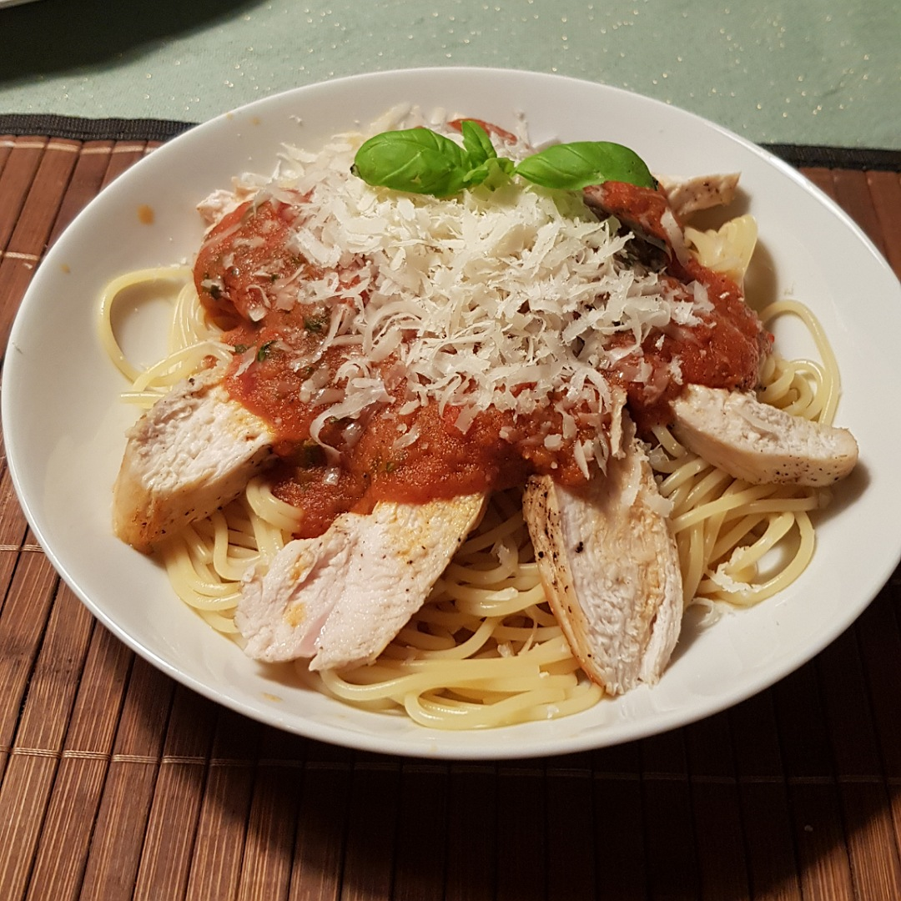

# Spaghetti Pollo che Brucia



## Source code
Run the following code to cook one meal:

```c

#include <oven.h>
#include <pot.h>
#include <pan.h>
#include <kitchen.h>

int main() {

    // ingredients
    Spaghetti_g speghetti = 125;
    Tomatoes tomatoes = 2;
    ChickenBreast chicken = 1;
    Garlic garlic = 1;
    RedChili_cm chili = 2;
    Basil basil = 10
    RedWine_ml wine = 100;

    oven_convection_degree_C(160);

    // prepare tomatoes
    pot_fill_water_L(1);
    pot_heat_level(9);
    knife_cut_in(tomatoes);
    pot_include(tomatoes)
    hourglass_sleep_min(1.5)
    pot_tip_out();
    cool_under_water(tomatoes);
    pull_off_skin(tomatoes);
    knife_cut_into_pieces(tomatoes);

    // cook chicken breast
    wash_under_water(chicken);
    pan_heat_level(8);
    pan_include(3*SPOON_OLIVE_OIL);
    pan_include(chicken);
    hourglass_sleep_min(2);
    pan_turn_content();
    pan_include(SALT_AND_PEPPER);
    hourglass_sleep_min(2);
    oven_include(chicken);
    hourglass_timer_min(20);

    // make sauce
    knife_cut_slices(garlic);
    knife_cut_slices(chili);
    pan_heat_level(7);
    pan_include(garlic);
    pan_include(chili);
    hourglass_sleep_min(2);
    pan_include(wine);
    pan_include(tomatoes);
    pan_heat_level(4);
    
    // spaghetti
    Spaghetti_cook(spaghetti);

    // finish sauce
    mixer_blend(pan_content());
    pan_include(SPOON_SUGAR);
    pan_include(SALT_AND_PEPPER);
    knife_cut_into_pieces(basil);
    pan_include(basil);
    pan_include(Spaghetti_salt_water());

    serve();
}
```
