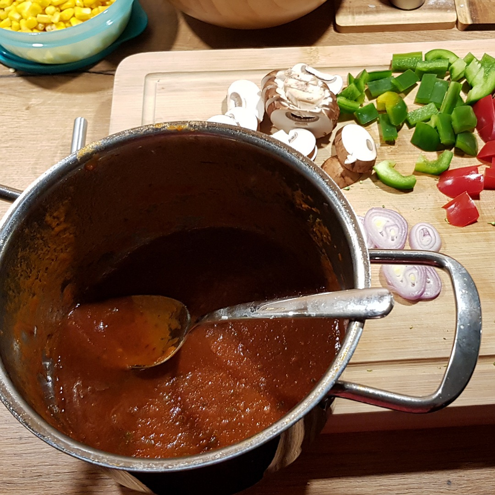

# Tomato Sauce



## Source code
Run the following code to cook a sauce:

```c
#include <kitchen.h>

// recipe below main
void peel_tomatoes(Tomatoes tomatoes);

int main() {

    // ingredients
    Tomatoes tpmatoes       = 4;
    Garlic   garlic         = 1;
    Onion    onion          = 1;
    Basil    basil          = 6;
    RedWine  wine           = ML(100);
    BalsamicVinegar vinegar = ML(25);

    // todo
   
    
    serve();
}

void peel_tomatoes(Tomatoes tomatoes) {
    pot_fill_water_L(1);
    pot_heat_level(9);
    knife_cut_in(tomatoes);
    pot_wait_until_boil();
    pot_include(tomatoes)
    hourglass_wait_min(1.5)
    pot_pour_out();
    cool_under_water(tomatoes);
    pull_off_skin(tomatoes);
}

```
