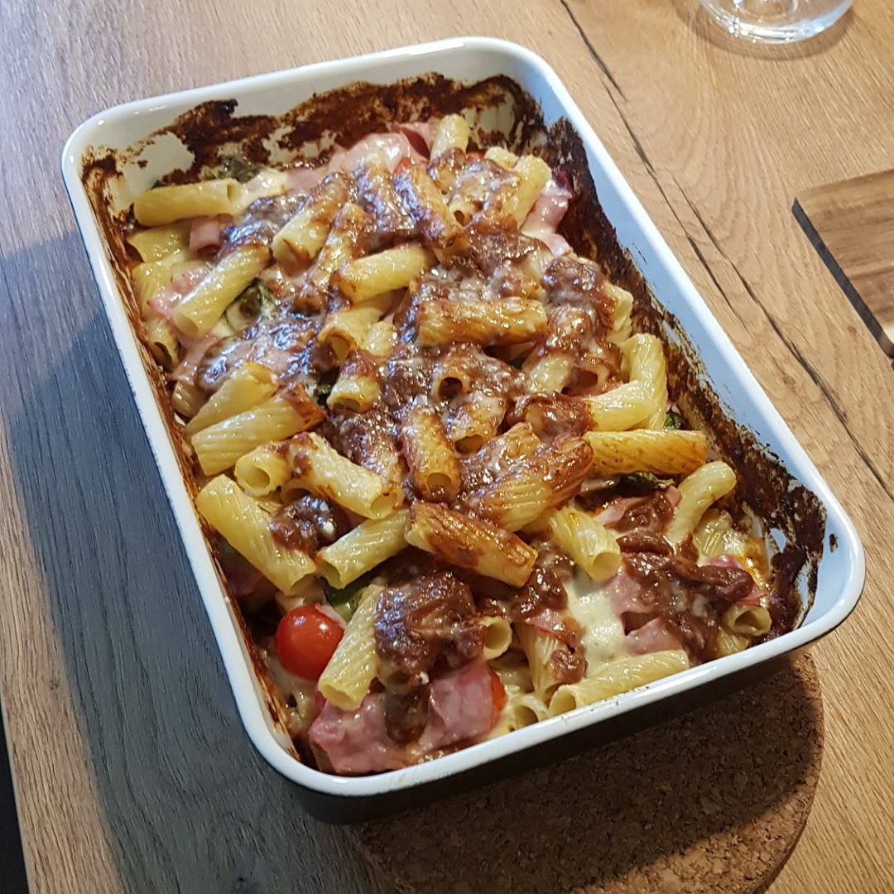

# Tortiglioni al forno



## Source code
Run the following code to cook two meals:

(Needs a [tomato sauce](Tomato_Sauce.md))

```c
#include <kitchen.h>

// see Tomato_sauce.md
Portion *make_tomato_sauce();

// recipe below main
void cook_tortiglioni(Portion *tortiglioni);

int main() {

    // ingredients
    Portion *tortiglioni = Tortiglioni_g(250);
    Portion *mozerella   = Mozerella_g(100);
    Portion *parmesan    = Parmesan_g(50);
    Portion *ham         = CookedHam_g(50);
    Portion *tomatoes    = CherryTomatoes(8);
    Portion *basil       = Basil(8);
    // Warning: tomato sauce needs its own ingredients!

    // see Tomato_sauce.md
    Portion *sauce = make_tomato_sauce();
   
    // tortiglioni (see below)
    cook_tortiglioni(tortiglioni);

    // prepare
    oven_heat_C(180);
    knife_cut_into_pieces(mozerella);
    knife_cut_into_pieces(ham);
    knife_cut_in_half(tomatoes);
    slice(parmesan);

    // lay layers
    baking_dish_include(sauce);
    baking_dish_include(tortiglioni);
    baking_dish_include(tomatoes);
    baking_dish_include(mozerella);
    baking_dish_include(ham);
    baking_dish_include(basil);

    // cover up
    baking_dish_include(tortiglioni);
    baking_dish_include(sauce);
    baking_dish_include(parmesan);

    // bake
    baking_dish_wrap_with_aluminium_foil();
    oven_include(baking_dish);
    hourglass_wait_min(20);
    baking_dish_remove_aluminium_foil();
    hourglass_wait_min(5);
    
    oven_take_out(baking_dish);

    serve();
}

void cook_tortiglioni(Portion *tortiglioni) {
    pot_fill_water_L(2);
    pot_heat_level(9);
    pot_wait_until_boil();
    pot_include(SALT);
    pot_include(tortiglioni);
    hourglass_wait_min(TORTIGLIONI_COOK_TIME);
    pot_pour_out();
}

```
