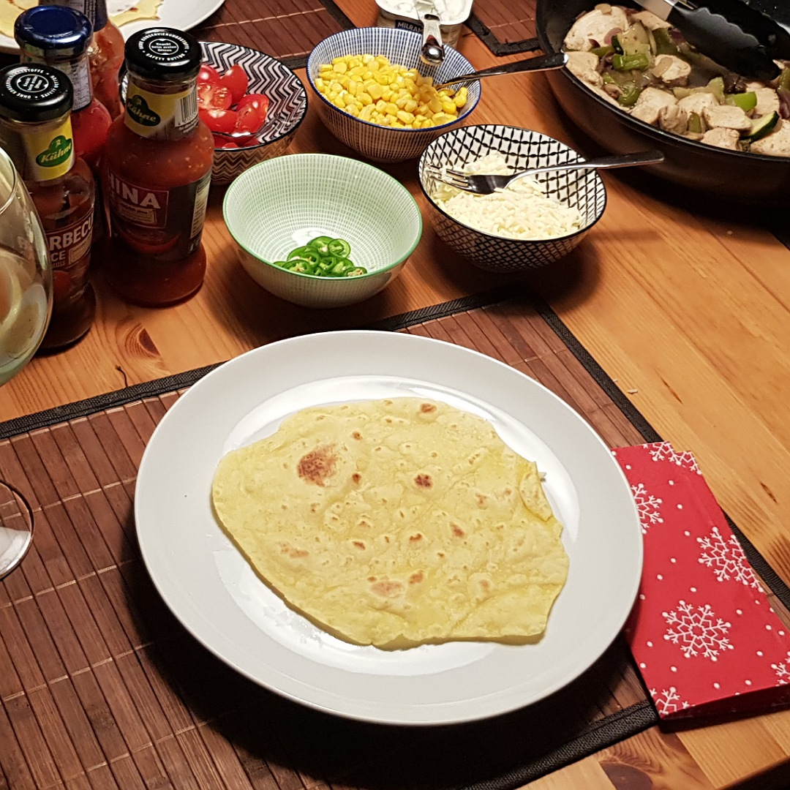

# Tortillas



## Source code
Run the following code to cock four Tortillas:

```c
#include <kitchen.h>

static const bool got_tortilla_press = true;

int main() {

    // ingredients
    Flour     flour     = 50 * G;
    Cornflour cornflour = 50 * G;
    OliveOil  oil       = 15 * ML;


    // make tortilla dough
    bowl_include(flour);
    bowl_include(cornflour);
    bowl_include(oil);
    bowl_include(50 * WARM_WATER_ML);
    bowl_include(SALT);
    bowl_knead_min(5);
    Dough dough = bowl_content();
    fridge_include(dough);
    hourglass_wait_min(15);

    // fry tortillas
    roll_out(dough);
    knife_cut_into_n_pieces(dough, 4);
    roll_out(dough);
    pan_heat_level(8);
    for(int i=0; i<4; i++) {
        if(got_tortilla_press) {
            tortilla_press(dough);
        } else {
            rolling_pin_flatten(dough);
        }
        pan_include(dough);
        hourglass_wait_sec(45);
        pan_turn_content();
        hourglass_wait_sec(45);
        Tortilla tortilla = pan_content();
    }

    serve();
}

```
